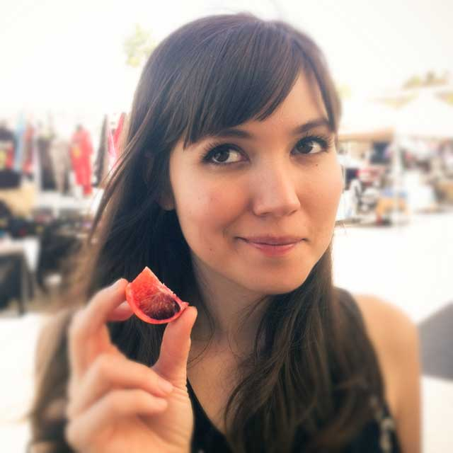

`Antigua Coffee House Presents,`

# [Quetzaltenango][home]

+ [Events](http://pspegg.co/antigua/events)
+ [Beans](http://pspegg.co/antigua/beans)
+ [Tunnel](http://pspegg.co/antigua/tunnel)
+ [Address](#address)
+ [Subscribe](http://pspegg.us4.list-manage.com/subscribe?u=35aface29c085e2404590b639&id=a0513f3f58)

[home]: http://pspegg.co/antigua/index.html

`The little Cypress blog`

This is Issue one!  
[subscribe via email here](http://pspegg.us4.list-manage.com/subscribe?u=35aface29c085e2404590b639&id=a0513f3f58)  
Last week you wonderful people took the time  
and wrote us the sweetest comments ever.  
*They meant a lot*.

Time for us to write back.  
This weekly column is for you people. 
Let's kick it off with some exciting news...

###The Baker is Here###

**Michelle** is the magician behind the deliciously gluten-free, diary-free, soy-free, non-genetically-modified [**LA LA Bakies**][order].

Following the success of her [Kickstarter campaign][kickstarter] to achieve allergy-free baking, she bought an oven and set up head quarters in the shop.

[order]: http://lalabakies.com/collections/all
[kickstarter]:http://www.kickstarter.com/projects/2074574548/la-la-bakies-a-vegan-and-gluten-free-alternative-b

###TEDTALK: [Gangster Gardener][finley]

> I live in South Central. This is South Central: liquor stores, fast food, vacant lots.

**Community** is in the grit, the sweat and the giving. It's something solid you can touch.

[finley]: http://www.ted.com/talks/ron_finley_a_guerilla_gardener_in_south_central_la.html

###Our Tunnels###

[*patrick.ferry.754:*](http://pspegg.co/antigua/tunnel)

> I love to see the energy of multiple projects feeding each other: the tunnels, arts, biking, river conservation, pedestrianism, rethinking transportation, and, mostly, getting people in a community to know each other better, to hang out, to grow together and serve one another.  

For those not following the [Facebook](https://www.facebook.com/antiguacoffeeroasters) page, last week we got the tunnel project into [this contest][2050], and *boy* was I humbled by the comments. You all are so smart that I just keep nodding in agreement. Also,

### David Fonseca: [the orgins of Antigua Coffee Hub][david] 

I've started a page dedicated to the tunnels project [here](http://pspegg.co/antigua/tunnel), where I collect all the comments we got. And you can always support us by subscribing to our [beans](http://pspegg.co/antigua/beans). 

Now, a few more fun stuff.

[david]: http://highlandpark-ca.patch.com/articles/antigua-owner-sees-shop-as-cultural-hub#photo-13897880

[2050]: http://myla2050.maker.good.is/projects/tunnel-art-walk

###RADIO: [The New Disruptors Interviews Tonx Coffee][]###

LA's **Tonx Coffee** doesn't want the world. They just do one thing best: consistently ship small bags of very fresh beans *directly* to customers.

[The New Disruptors Interviews Tonx Coffee]: http://www.muleradio.net/newdisruptors/3/

###THINK: [The Case for Drinking as Much Coffee as You Like][]###

> "What I tell patients is, if you like coffee, go ahead and drink as much as you want and can," 

I told you so.

[The Case for Drinking as Much Coffee as You Like]: http://www.theatlantic.com/health/archive/2012/11/the-case-for-drinking-as-much-coffee-as-you-like/265693/

###Sponsor: [Dan’s Design Subscription](http://pspegg.com)

Dan had been designing websites in his free time for his friends and his favorite restaurants.

He just figured out how to charge subscription fees, and is in the process of taking the inactive sites pro for those willing to commit with him.

In fact, Quetzaltenango is the first one on his to-do list! The source code for this website is on [Github](http://github.com/pspEgg/antigua) for you to comment on, contribute and even remix your own site with. Dan is [@pspEgg on twitter](http://twitter.com/pspEgg).

Go to <http://pspegg.com>

###Guest Post: Own what your write

Dan explains how Markdown and Dropbox can get you started on writing for the future even without a blog.

[continue reading...](http://pspegg.co/antigua/tunnel)

