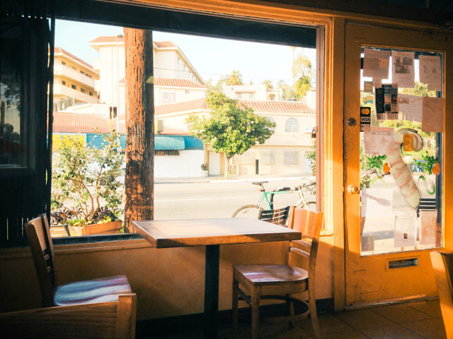

Dan Presents,

# the Menu #

+ lean sites for patrons and scale

We will talk about...

+ How you inspired me to do this.
+ How the design is built to last, do-it-yourself and expand on
+ The ways and perks you can support my efforts by subscribing.

## Americano ##

coffee inspired community

It's crazy that I took this photo on Jan 13.

## Markdown ##

bullet proof design

The **Markdown** syntax is at the center of all this.

## Subscription ##

support

I did some calculation and the breaking point of going full time with the instructional website is $48, to support directly 2-4 websites a month for $100 and to actively develop for 1-2 $250